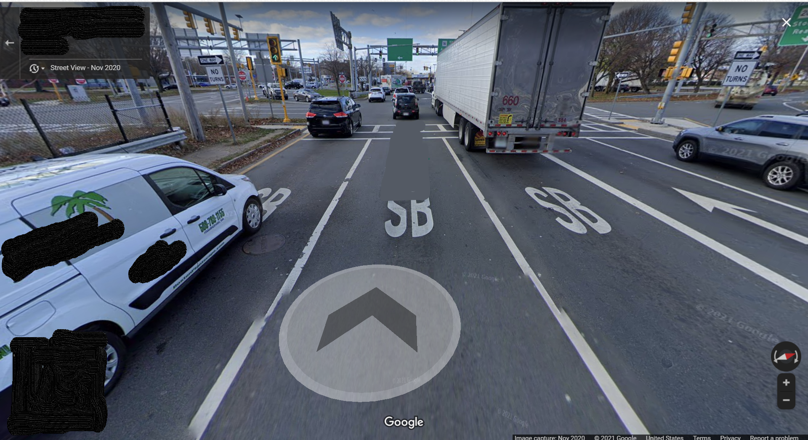
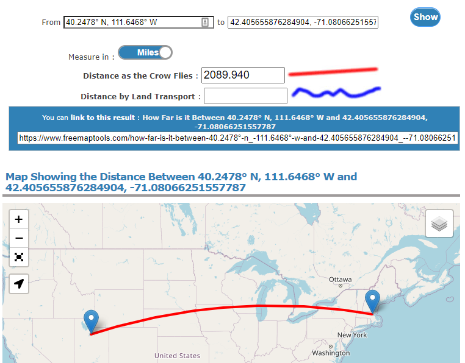

# Oh the Roads You'll Go - OSINT - Hard  

## Challenge
Can you imagine Provo drivers in this intersection? I can't! Thank goodness it is x amount of miles from the Crabtree...  

Flag is ctf{x} where x is the number of miles as the crow flies from the Crabtree Building to this intersection +/- 2 miles.

## Process
In this OSINT challenge, we are given this screenshot from Google Maps and are tasked with finding its location. Looking at the image, we see that there are a few pieces of information that can help us. 

> Note: The SB (South Bound) letters on the are incorrect. Look at the compass in the bottom right corner.  

1. Look Up Phone Number on the Car
 - Looking up the area code we can narrow down the region where this intersection is 
 - Looking up the phone number we can find the business that it belongs to and where they are located. The business was located in Framington, which I though was going to be helpful but it wasn't. The area code was all we were supposed to need. 
2. Look Up Route Numbers
 - This intersection is on Route 16
 - There is a partly covered sign that starts with the number 2
 - Locate intersections on Route 16 that begin with 2 
 - Look at the Wikipedia article for Massachusetts Route 16
 - In this article we can see the different major intersections along Route 16
 - One of the major routes is 28 in Reading. Looking back at the picture we ca see that on the sign there appears to be the letters "Rea". It seems we are on the right track!
 
 3. Find the Intersection
 - Open Google Maps and locate where Route 16 intersects with Route 28 in Reading, Massachusetts
 - We found it!
 4. Calculate Miles
 - Copy coordinates of intersection  (42.4056915255047, -71.08071615965494)
 - Google the BYU Crabtree coordinates  (40.2478° N, 111.6468° W)
 - Enter both coordinates into an online tool ([FreeMapTools](https://www.freemaptools.com/how-far-is-it-between-boston_-massachussets-and-los-angeles-california_-usa.htm) works) that will calculate the distance as the crow flies
 
 - Bam! There's your answer  
   
## Flag
 **ctf{2089}**