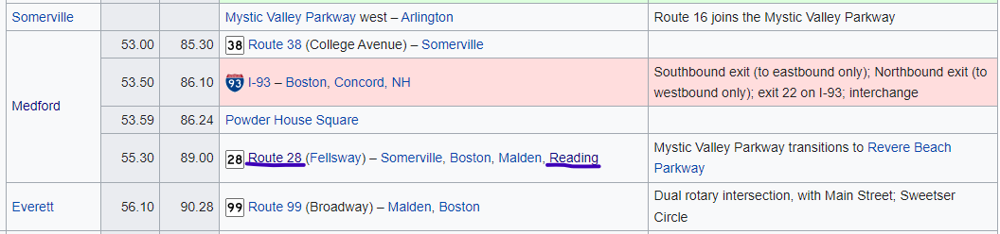
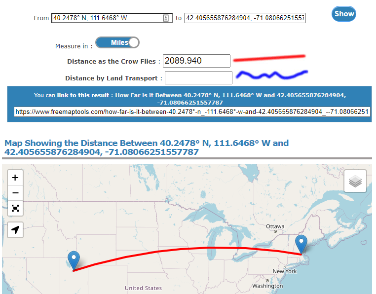

# Oh the Roads You'll Go - OSINT - Hard  

## Challenge
Can you imagine Provo drivers in this intersection? I can't! Thank goodness it is x amount of miles from the Crabtree...  

Flag is ctf{x} where x is the number of miles as the crow flies from the Crabtree Building to this intersection +/- 2 miles.

## Process
In this OSINT challenge, we are given this screenshot from Google Maps and are tasked with finding its location. Looking at the image, we see that there are a few pieces of information that can help us. 

> Note: The SB (South Bound) letters on the are incorrect. Look at the compass in the bottom right corner.  

1. Look Up Phone Number on the Car
 - Looking up the area code, we know that this is somewhere in Massachusetts
 - While the whole phone number belongs to Boston Plantscape in Framingham, MA, we will find out later that that information is not relevant. 
2. Look Up Route Numbers
 - The first visible sign shows that this road is on Route 16
 - There is a partly covered sign that starts with the number 2
 - Looking at the Wikipedia article for Massachusetts Route 16, we can see the major intersections on this route.
 - One of the major intersecting routes is 28 in Reading. Looking back at the picture we can see that on the sign there appears to be the letters "Rea". It seems we are on the right track!
 
 3. Find the Intersection
 - Open Google Maps and locate where Route 16 intersects with Route 28 in Reading, Massachusetts
 - We found it!
 4. Calculate Miles
 - Copy coordinates of intersection (42.4056915255047, -71.08071615965494)
 - Google the BYU Crabtree coordinates (40.2478° N, 111.6468° W)
 - Enter both coordinates into an online tool ([FreeMapTools](https://www.freemaptools.com/how-far-is-it-between-boston_-massachussets-and-los-angeles-california_-usa.htm) to calculate the distance as the crow flie
 
 - Bam! There's your answer  
   
## Flag
 **ctf{2089}**

## Real World Application
This challenge was a great way to learn how to find small pieces of data from an initial source and build off those pieces to gather more information. In the image there was some information that looked like it could be helpful, but further investigation later showed that that data was irrelevant. Because of that, this challenge was also a great exercise for knowing how to determine what data is relevant and what is not.