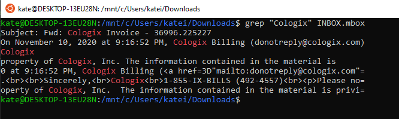
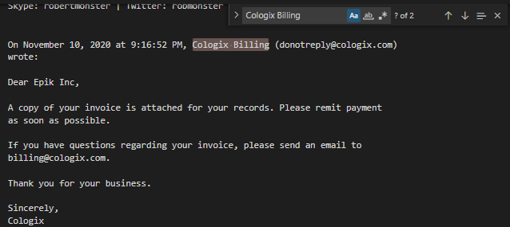
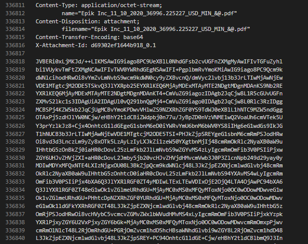
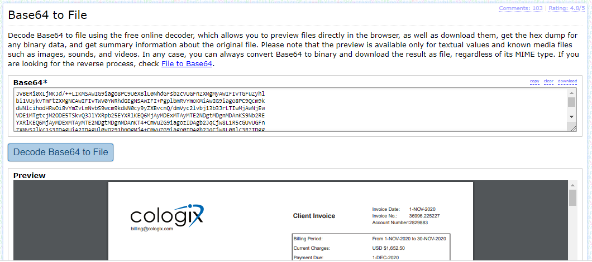

# Routing - Forensics - Hard  

## Challenge
I had a friend send me a bunch of emails that were recovered from the epik.com breach. What is the ACH Routing number for Cologix?

Example flag - ctf{00000000}

Disclaimer - these are actual emails from the breach, so please be careful and do not interact with any IP addresses or domains found here.

File: INBOX.mbox

## Process
1. Grep File to Find Relevant Lines
 First thing I did was download the file and in a Linux Command Line ran ```grep "Cologix" INBOX.mbox```. This printed out all lines in the file that had the word "Cologix". In the results of this command, there was one line that I though was most interested in: "Cologix Billing". Since I was searching for an ACH routing number, this seemed relevant. 

 

2. View Relevant Line in a File Editor
 After finding the relevant line, I opened the file in Visual Studio Code and searched the file using 'Ctrl + f'. Searching for "Cologix Billing" brought me to an email, very deep in the file, that said contained a copy of an invoice. Scrolling to the end of this email, we see that there are attachments and the Base64 encodings of the attachments. One of the attachments is a PNG and the other is a PDF.    

  

 

3. Convert Base64 back to PDF
 After finding the Base64 encoding of the PDF, I placed it in an [online tool](https://base64.guru/converter/decode/file) that would convert it back to a PDF file. From here, I was able to view the file and find the routing number we were looking for. 
 
 


## Real World Application